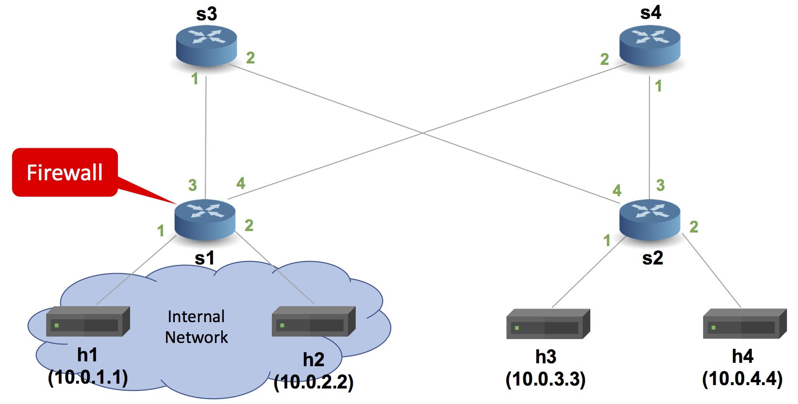

# Implementing A Basic Stateful Firewall

## Introduction

The objective of this exercise is to write a P4 program that
implements a simple stateful firewall. To do this, we will use
a bloom filter. You will need two different `p4` codes in this assignment, one is the code from the [Basic Forwarding](../basic) assignment which you should place in this folder named as `basic.p4` (assuming you finished the Basic Forwarding assignment and your solution works) and the other one is the `firewall.p4` which is a skeleton is provided in this assignment and you must implement it.

We will use the pod-topology for this exercise, which consists of four hosts connected to four switches, which are wired up as they would be in a single pod of a fat tree topology.



Switch s1 will be configured with our (`firewall.p4`) code, and the rest of the switches will run the basic router program (`basic.p4`).

The firewall on s1 should have the following functionality:
* Hosts h1 and h2 are on the internal network and can always
  connect to one another.
* Hosts h1 and h2 can freely connect to h3 and h4 on the
  external network.
* Hosts h3 and h4 can only reply to connections once they have been
  established from either h1 or h2, but cannot initiate new
  connections to hosts on the internal network.

Our P4 program will be written for the V1Model architecture implemented
on P4.org's bmv2 software switch. The architecture file for the V1Model
can be found at: /usr/local/share/p4c/p4include/v1model.p4. This file
desribes the interfaces of the P4 programmable elements in the architecture,
the supported externs, as well as the architecture's standard metadata
fields. We encourage you to take a look at it.

## Step 1: Run the (incomplete) starter code

The directory with this README also contains a skeleton P4 program,
`firewall.p4`. Your job will be to extend this skeleton program to
properly implement the firewall.

Before that, let's compile the incomplete `firewall.p4` and bring
up a switch in Mininet to test its behavior.

1. In your shell, run:
   ```bash
   make run
   ```
   This will:
   * compile `firewall.p4`, and
   * start the pod-topo in Mininet and configure all switches with
   the appropriate P4 program + table entries, and
   * configure all hosts with the commands listed in
   [pod-topo/topology.json](./pod-topo/topology.json)

2. You should now see a Mininet command prompt. Try to run some iperf
   TCP flows between the hosts. TCP flows within the internal 
   network should work:
   ```bash
   mininet> iperf h1 h2
   ```

   TCP flows from hosts in the internal network to the outside hosts 
   should also work:
   ```bash
   mininet> iperf h1 h3
   ```   

   TCP flows from the outside hosts to hosts inside the 
   internal network should NOT work. However, since the firewall is not 
   implemented yet, the following should work: 
   ```bash
   mininet> iperf h3 h1
   ```

3. Type `exit` to leave the Mininet command line.
   Then, to stop mininet:
   ```bash
   make stop
   ```
   And to delete all pcaps, build files, and logs:
   ```bash
   make clean
   ```

### A note about the control plane

A P4 program defines a packet-processing pipeline, but the rules
within each table are inserted by the control plane. When a rule
matches a packet, its action is invoked with parameters supplied by
the control plane as part of the rule.

In this exercise, we have already implemented the the control plane
logic for you. As part of bringing up the Mininet instance, the
`make` command will install packet-processing rules in the tables of
each switch. These are defined in the `sX-runtime.json` files, where
`X` corresponds to the switch number.

**Important:** We use P4Runtime to install the control plane rules. The
content of files `sX-runtime.json` refer to specific names of tables, keys, and
actions, as defined in the P4Info file produced by the compiler (look for the
file `build/firewall.p4.p4info.txt` after executing `make run`). Any changes in the P4
program that add or rename tables, keys, or actions will need to be reflected in
these `sX-runtime.json` files.

## Step 2: Implement Firewall

We will use a bloom filter with two hash functions to check if a packet coming into the internal network is a part of an already established TCP connection. We will use two different register arrays for the bloom filter, each to be updated by a hash function. Using different register arrays makes our design amenable to high-speed P4 targets that typically allow only one access to a register array per packet. You will have to implement the following.

1. The definitions for the bloom filter and the TCP metadata are already defined in `firewall.p4`.
2. Parsers for Ethernet, IPv4 and TCP that populate `ethernet_t`, `ipv4_t` and `tcp_t` fields. You can reuse the code from `basic.p4` assuming it's working.
3. While parsing IPv4 packets, change the transition from `accept` to `select`, the transition must receive the `hdr.ipv4.protocol` as parameter. During the transition, add the rules of `TYPE_TCP: tcp` and set `default` as accept.
4. Lastly in the parser, implement a tcp state called `tcp`, extract the `hdr.tcp` from the packet and accept the transition.
5. In the Ingress, you will see that registers and other parameters for the bloom filter are already in place as well as a `compute_hashes` action and a `check_ports` table.
6. Implement the `ipv4_forward` action. If your `basic.p4` is working you can simply reuse it.
7. Add an action called `set_direction` that receives a 1 bit argument called `dir`. This action must simply add the value of dir to `direction`.
8. During `apply` inside ingress, you will have to implement the firewall logic. 
    1. You must verify if the IPv4 and TCP headers are valid, and then proceed to implement the actual firewall rules. 
    2. Start off verifying the packet's ports against the `check_ports` table using `check_ports.apply().hit`, as it sets the direction of the packet.
    3. You will need to verify the `direction` of the packet(`0` for outbound and `1` for inbound) for building the logic, refer to Step 1 - item 2 about the expected behaviour.
    4. You will need to compute the hashes for the bloom filter using the `compute_hashes` function.
    5. For managing allowed or blocking traffic you will have to write or read entries from `bloom_filter_1` and `bloom_filter_2`. For outbound connections (`direction == 0`), verify if it's the start of a new connection using `hdr.tcp.syn` (1 for new connections). PS: Use the provided registers as memory for writting and reading from the bloom filter table, for writting in the table use `bloom_filter.write(reg_pos, 1)` and for reading `bloom_filter.read(reg_val, reg_pos)`.
    6. Inbound traffic is only allowed if both entries to the bloom filter table are set.
9. Properly adapt the deparser.

## Step 3: Run your solution

Follow the instructions from Step 1. This time, the `iperf` flow between
h3 and h1 should be blocked by the firewall.

### Troubleshooting

There are several problems that might manifest as you develop your program:

1. `firewall.p4` might fail to compile. In this case, `make run` will
report the error emitted from the compiler and halt.

2. `firewall.p4` might compile but fail to support the control plane
rules in the `s1-runtime.json` file that `make run` tries to install
using P4Runtime. In this case, `make run` will report errors if control
plane rules cannot be installed. Use these error messages to fix your
`firewall.p4` implementation.

3. `firewall.p4` might compile, and the control plane rules might be
installed, but the switch might not process packets in the desired
way. The `logs/sX.log` files contain detailed logs that describe
how each switch processes each packet. The output is detailed and can
help pinpoint logic errors in your implementation.

4. If you run into permission denials and problems while running p4 code or python scripts, try running as `sudo` and/or `chmod` your files as required.

#### Cleaning up Mininet

In the latter two cases above, `make run` may leave a Mininet instance
running in the background. Use the following command to clean up
these instances:

```bash
make stop
```

## Next Steps

Congratulations, your implementation works! Proceed to the last two assignments.