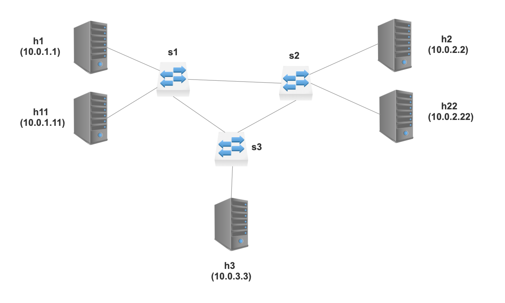

# Implementing QOS

## Introduction

The objective of this tutorial is to extend basic L3 forwarding with
an implementation of Quality of Service (QOS) using Differentiated Services.

Diffserv is simple and scalable. It classifies and manages network traffic and provides QOS on modern IP networks.

As before, we have already defined the control plane rules for routing, so you only need to implement the data plane logic of your P4 program.

## Step 1: Run the (incomplete) starter code

The directory with this README also contains a skeleton P4 program,
`qos.p4`, which initially implements L3 forwarding. Your job (in the
next step) will be to extend it to properly set the `diffserv` bits.

Before that, let's compile the incomplete `qos.p4` and bring up a
network in Mininet to test its behavior.

1. In your shell, run:
   ```bash
   make
   ```
   This will:
   * compile `qos.p4`, and
   * start a Mininet instance with three switches (`s1`, `s2`, `s3`) configured
     in a triangle. There are 5 hosts. `h1` and `h11` are connected to `s1`.
     `h2` and `h22` are connected to `s2` and `h3` is connected to `s3`.
   * The hosts are assigned IPs of `10.0.1.1`, `10.0.2.2`, etc
     (`10.0.<Switchid>.<hostID>`).
   * The control plane programs the P4 tables in each switch based on
     `sx-runtime.json`

2. We want to send traffic from `h1` to `h2`. If we capture packets at `h2`, we should see the right diffserv value.



3. You should now see a Mininet command prompt. Open two terminals
for `h1` and `h2`, respectively:
   ```bash
   mininet> xterm h1 h2
   ```
4. In `h2`'s XTerm, start the server that captures packets:
   ```bash
   ./receive.py
   ```
5. In `h1`'s XTerm, send one packet per second to `h2` using send.py
say for 30 seconds.
   To send UDP:
   ```bash
   ./send.py --p=UDP --des=10.0.2.2 --m="P4 is cool" --dur=30
   ```
   To send TCP:
   ```bash
   ./send.py --p=TCP --des=10.0.2.2 --m="P4 is cool" --dur=30
   ```
   The message "P4 is cool" should be received in `h2`'s xterm,
6. At `h2`, the `ipv4.tos` field (DiffServ+ECN) is always 1
7. type `exit` to close each XTerm window

Your job is to extend the code in `qos.p4` to implement the diffserv logic for setting the diffserv flag.

## Step 2: Implement Diffserv

The `qos.p4` file contains a skeleton P4 program. You will have to:

1. Set up `MyParser` accordingly to the [Basic Forwarding](../basic) assignment. You can reuse code if it works.
2. Set up `MyIngress` accordingly to the [Basic Forwarding](../basic) assignment. You can reuse code if it works.
3. Split the 8 bit `tos` field on the IPv4 header in two other fields: `diffServ` with 6 bits and `ecn` with 2 bits.
4. Add three new actions to `MyIngress`: `default_forwarding`, `expedited_forwarding` and `voice_admit`, these actions must set the `diffserv` IPv4 header to `0`, `46` and `44`, respectively.
5. When applying the Ingress, check if the IPv4 header is valid, then proceed to verify if the IPv4 protocol header is `IP_PROTOCOLS_UDP` or `IP_PROTOCOLS_TCP`, invoke `expedited_forwarding` or `voice_admit` respectively.
6. Update the `MyComputeChecksum` control accordingly to the changes in the IPv4 header.

## Step 3: Run your solution

Follow the instructions from Step 1. This time, when your message from
`h1` is delivered to `h2`, you should see `tos` values change from 0x1
to  0xb9 for UDP and 0xb1 for TCP. It depends upon the action you choose 
in Ingress processing.

To easily track the `tos` values you may want to redirect the output
of `h2` to a file by running the following for `h2`
   ```bash
   ./receive.py > h2.log
   ```
and just print the `tos` values `grep tos h2.log` in a separate window
```
     tos       = 0xb9
     tos       = 0xb9
     tos       = 0xb9
     tos       = 0xb9
     tos       = 0xb9
     tos       = 0xb9
     tos       = 0xb9
     tos       = 0xb9
     tos       = 0xb1
     tos       = 0xb1
     tos       = 0xb1
     tos       = 0xb1
     tos       = 0xb1
     tos       = 0xb1
     tos       = 0xb1
     tos       = 0xb1

```

### Food for thought

How can we let the user use other protocols?

### Troubleshooting

There are several ways that problems might manifest:

1. `qos.p4` fails to compile.  In this case, `make` will report the
   error emitted from the compiler and stop.
2. `qos.p4` compiles but does not support the control plane rules in
   the `sX-runtime.json` files that `make` tries to install using
   a Python controller. In this case, `make` will log the controller output
   in the `logs` directory. Use these error messages to fix your `qos.p4`
   implementation.
3. `qos.p4` compiles, and the control plane rules are installed, but
   the switch does not process packets in the desired way.  The
   `/tmp/p4s.<switch-name>.log` files contain trace messages
   describing how each switch processes each packet.  The output is
   detailed and can help pinpoint logic errors in your implementation.
   The `build/<switch-name>-<interface-name>.pcap` also contains the
   pcap of packets on each interface. Use `tcpdump -r <filename> -xxx`
   to print the hexdump of the packets.
4. If you run into permission denials and problems while running p4 code or python scripts, try running as `sudo` and/or `chmod` your files as required.


#### Cleaning up Mininet

In the latter two cases above, `make` may leave a Mininet instance
running in the background.  Use the following command to clean up
these instances:

```bash
make stop
```
